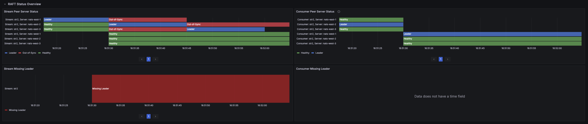
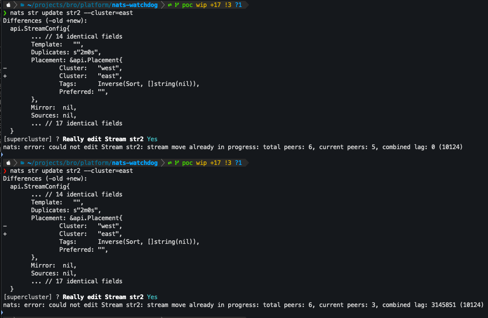
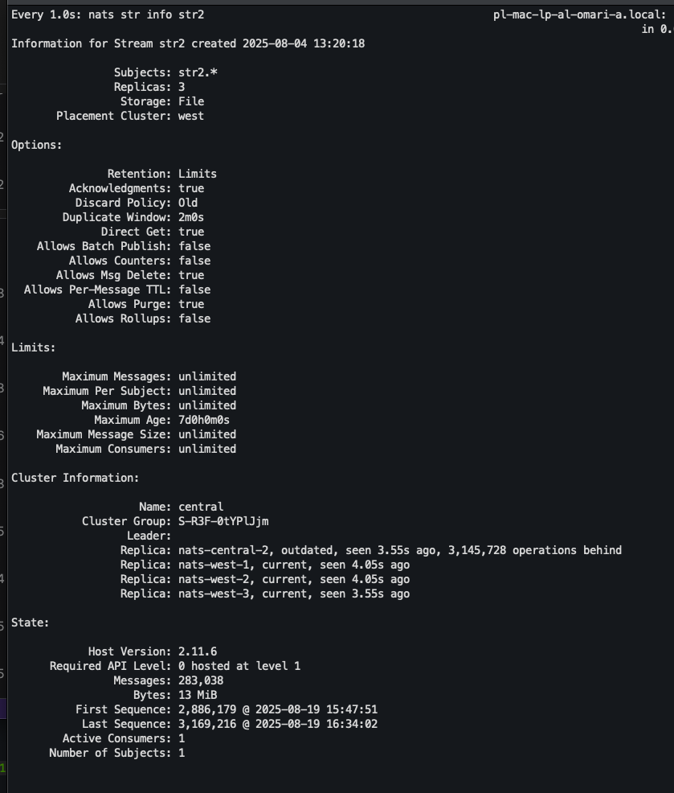
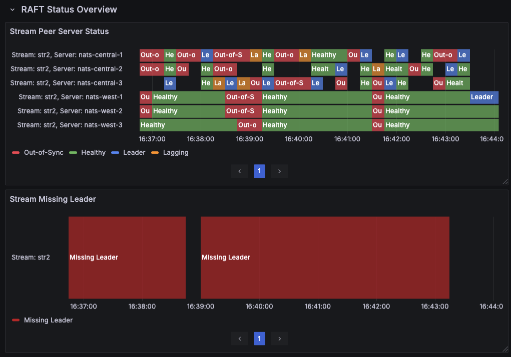
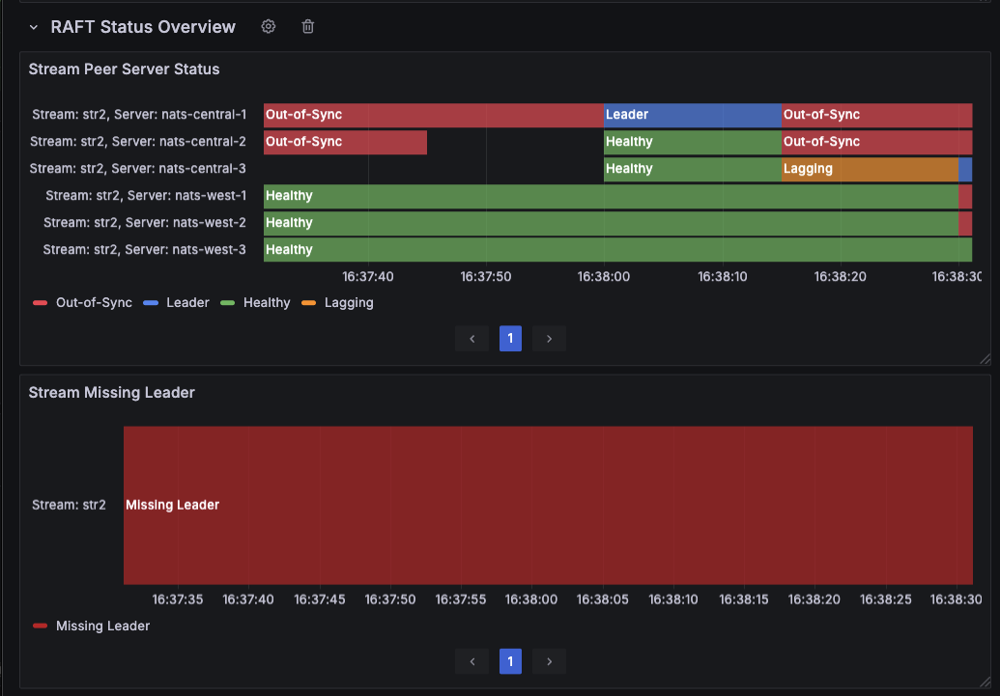
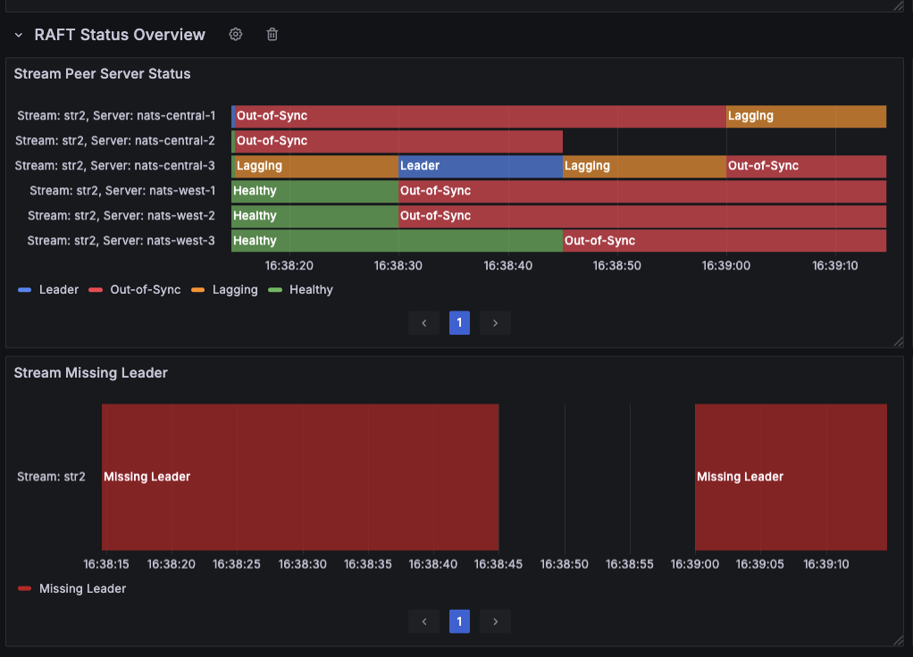

# Moving Streams between clusters in the Super-Cluster

> TL;DR
>
> It's possible to move streams between clusters in the Super-Cluster installation by changing the placement configuration.
>
> It's preferred to have a maintenance period (downtime) planned for the concrete stream to avoid issues with RAFT elections and be ready for the stream unavailability.

## Introduction

In Super-Cluster topology each cluster have its unique name declared in the nats-server.conf of every node of the cluster. Example:

```
# nats-server.conf

# Clustering configuration
cluster {
  name: "east"
  port: 6222
  routes: [
    "nats-route://nats-east-1:6222",
    "nats-route://nats-east-2:6222",
    "nats-route://nats-east-3:6222"
  ]
}
```

The cluster name can be used for the stream's placement configuration:

```jsonc
// stream-config.json

{
  "placement": {
    "cluster": "<CLUSTER_NAME>"
  }
}
```

## Movement steps

Updating the placement on the existing stream triggers a so-called "movement" operation that happens in the following way:

- NATS checks if the destination cluster has enough nodes to satisfy the stream replication requirements.
  - If the destination cluster has less nodes available than the stream requires, the configuration change won't be applied.
  - The change is applied to the stream configuration.
  - The stream becomes unavailable for a short amount of time.
    - Usually takes <0.5s. During that period operations on the stream or against the stream can't be completed.
    - ⚠️ During the movement stream RAFT may lose quorum, making the stream unavailable for longer period of time. Even 5-10m outages were observed (see the outages section below).
  - During the movement, current lead in the original cluster remains a leader. If election is happening, any node in the original cluster can get elected.
  - Once all nodes of the destination cluster caught up, the leadership is transferred to one of the nodes in the destination cluster.
    - ⚠️ It may be that no leader can is selected in the destination cluster. In that case nodes from the original cluster may become candidate, but never do they become leaders. During the stabilization time, the stream is not available.
    - 💡Interesting observation: consumer RAFT state is not affected by the stream's state.
      

## Insights

- Using raw nats publish (either cli or any client library) makes a publish that can't fail unless the connection to the server is down.
  - CLI: nats publish
  - Client code: connection.publish()
    - JavaScript client won't fail on publish even the connection is down. Every potential failure is caught and ignored by the client library.
- Using jetstream publish ensures the message is not only delivered via TCP to the server, but also properly captured by the stream.
  - This makes sure the client code is able to wait for the message to be properly captured or be notified if the exception is thrown.
  - CLI: nats publish --jetstream
  - Client code: jetStream.publish()
- Movement can be started for any stream despite the original cluster health, which means the original cluster may have some nodes offline/out-of-sync/lagging.
  - The general stream availability rule is the same: >50% of the nodes in the cluster have to be available.
- Only one movement of the stream at a time is allowed.
  

## Findings

- ⚠️ Leadership transfer triggered by any cause causes the stream to not capture (miss) new messages.
  - Leadership transfer may be triggered either:
    - Manually via nats str cluster step-down .
    - By server becoming unavailable/offline (network issue, manual shutdown, etc.).
    - Change of the stream placement, which in fact forces the stream to be moved to a different cluster.
  - Any new messages expected to be captured are in fact lost. With the rate of 3.5K msg/s ~0.01% of messages are lost (not captured by the stream).
- 💡 Changing the stream placement causes the loss of the messages.
  - Moving the stream to another cluster makes all the requested amount of nodes in the destination cluster, say 3, peers as replicas until they catch up.
  - Even though the leader from the original cluster stays a leader for the time the receiving cluster catching up, the same ~0.01% amount of messages are lost (not captured by the stream).
  - The reason for such behavior is the stream becoming "unavailable" to capture messages.
- 💡 Having different nats server node count across the clusters may lead to unexpected results.
  - Say there're 3 clusters with 3,3,5 nats servers each.
  - Transferring stream to the cluster with higher nodes count makes all the nodes of the receiving cluster peers of the stream RAFT for a small amount of time (<0.5s). While seems harmless, such behaviour may lead to the quorum issues.
- 💡 Transferring stream to another cluster having an active publish in parallel leads may lead to the server/cluster/super-cluster outage.
  - Servers stop responding, making JetStream system unavailable.
  - Some servers get down without clear error logs (could be OOM).
  - So far could only be reproduced locally under engineering workload on macbook air.
  - During server lag period, the delivery to the client thus active consumption can be "frozen". This means that the publishment is still happening, stream captures new messages, consumer gets its unprocessed count incremented, but the client maintaining a flaky connection does not receive new message.
- 📝 Stream sequence reset.
  - We happened to reproduce the infamous bug that makes a stream sequence reset, while consumer maintains the old sequence, which leads to the consumption being stopped.
  - As we discussed, the only fix possible is to re-create the consumer.
- ✅ Transfer of the stale or empty stream is completely harmless.
  - If the stream doesn't get new messages captured, the transfer happens correctly and the same amount of messages is eventually transferred.

## Possible Outages

- RAFT unavailability.
  - Once the movement has started, quorum may be lost and the stream will be missing a leader, making it unavailable.
    
- Ghost replicas, temporary former leaders.
  - Nodes from original cluster may be shown as replicas or even leaders for a short period of time, but the stream is still not available.
    
    
    
